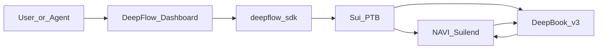

<p align="center">
  
</p>

<h1 align="center">DeepFlow</h1>

<p align="center"><strong>One-click liquidity routing across Sui DeFi and DeepBook.</strong></p>

<p align="center">
  <a href="https://deepflow-sui.vercel.app/">Website</a>
  &nbsp;·&nbsp;
  <a href="https://youtu.be/6bz4y6txcHg">Demo Video</a>
  &nbsp;·&nbsp;
  <a href="https://www.deepsurge.xyz/projects/caaabf62-2f23-439a-93ac-4dae7f971256">DeepSurge</a>
</p>

<p align="center">
  English · <a href="README.zh-CN.md">中文</a>
</p>

## Track

- [ ] Agentic Web
- [x] **DeFi & Payments**
- [ ] DeepBook
- [ ] Walrus

## Description

DeepFlow is a Sui-based DeFi liquidity routing aggregator that leverages Programmable Transaction Blocks (PTBs) to seamlessly connect various DeFi protocols with DeepBook, compressing tedious cross-platform accounting, yield rotation, and limit orders into a seamless, one-click experience.

## Problem & Solution

| Pain point | DeepFlow approach |
| --- | --- |
| Liquidity is fragmented across Sui DeFi; cross-protocol accounting is tedious | **Portfolio** — Total Assets, Idle vs Working Capital, utilization rate, asset composition, and protocol exposure in one dashboard |
| Yield rotation needs unstake → swap → redeposit with multiple signatures | **Trading (Swap)** — set Source (e.g. Suilend) and Destination (e.g. NAVI); one atomic PTB |
| Long-term holders must watch charts to buy the dip | **Trading (Limit)** — DeepBook limit orders with expiry; manage open orders and history |
| Supply/withdraw is disconnected from DeepBook balances | **Liquidity** — supply and withdraw with funding from Wallet or DeepBook BalanceManager |



## Demo Highlights

Full narration script: [`demo_scripts.md`](demo_scripts.md) · [Demo Video](https://youtu.be/6bz4y6txcHg)

### 1. Portfolio

Connect wallet → view Total Assets, Idle / Working Capital, utilization rate, asset composition, and per-protocol exposure without switching tabs.

### 2. Liquidity

Example: NAVI SUI pool — enter amount, **Supply** from Wallet or DeepBook; switch to **Withdraw** and redeem in one flow.

### 3. Trading

- **Swap (yield rotation)** — Pay SUI, Receive USDC; Source Suilend → Destination NAVI → **Execute** in one PTB.
- **Limit (DCA / buy the dip)** — preset target price and expiry (e.g. 7d); track **Open Limit Orders** and **Swap History** in the Orders panel.

## Links

| | |
| --- | --- |
| DeepSurge | https://www.deepsurge.xyz/projects/caaabf62-2f23-439a-93ac-4dae7f971256 |
| GitHub | https://github.com/EdisonARUI/DeepFlow |
| Demo Video | https://youtu.be/6bz4y6txcHg |
| Website | https://deepflow-sui.vercel.app/ |
| X | https://x.com/DeepFlowonSui |
| Discord | https://discord.gg/4xkah86gSd |
| Telegram | https://t.me/sui_deepflow |
| Email | zrui0761@gmail.com |

## Team

- [@EdisonARUI](https://github.com/EdisonARUI)

## Deployment

| | |
| --- | --- |
| **Network** | Sui Mainnet |
| **Package ID** | No custom Move package — execution is composed via [`packages/deepflow-sdk`](packages/deepflow-sdk) PTBs against existing on-chain protocols |
| **Integrated protocols** | NAVI, Suilend, DeepBook v3 (Mainnet) |

## Tech Stack

- Next.js 15 Dashboard · `@mysten/dapp-kit-react`
- `@deepflow/sdk` — PTB builder, policy validation, trade / supply-withdraw orchestration
- `@mysten/deepbook-v3` · `@naviprotocol/lending` · `@suilend/sdk`

## Roadmap

More Sui ecosystem protocols, additional DeepBook trading pairs, and margin / prediction markets on DeepBook.

---

## For Developers

```sh
npm install
npm run dev      # http://localhost:3000
npm test         # SDK + dashboard tests
```

| Document | Purpose |
| --- | --- |
| [`PRODUCT.md`](PRODUCT.md) | Product requirements |
| [`ARCHITECTURE.md`](ARCHITECTURE.md) | Architecture and security boundaries |
| [`CODING-RULES.md`](CODING-RULES.md) | Frontend / SDK coding conventions |

<p align="center">
  English · <a href="README.zh-CN.md">中文</a>
</p>
