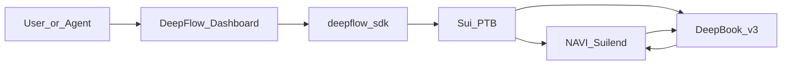

<p align="center">
  
</p>

<h1 align="center">DeepFlow</h1>

<p align="center"><strong>Sui DeFi 与 DeepBook 间的一键流动性路由。</strong></p>

<p align="center">
  <a href="https://deepflow-sui.vercel.app/">官网</a>
  &nbsp;·&nbsp;
  <a href="https://youtu.be/6bz4y6txcHg">演示视频</a>
  &nbsp;·&nbsp;
  <a href="https://www.deepsurge.xyz/projects/caaabf62-2f23-439a-93ac-4dae7f971256">DeepSurge</a>
</p>

<p align="center">
  <a href="README.md">English</a> · 中文
</p>

## 赛道

- [ ] Agentic Web
- [x] **DeFi & Payments**
- [ ] DeepBook
- [ ] Walrus

## 项目简介

DeepFlow 是基于 Sui 的 DeFi 流动性路由聚合器，利用可编程交易块（PTB）将各类 DeFi 协议与 DeepBook 无缝连接，把繁琐的跨平台记账、收益轮动和限价单操作压缩为流畅的一键体验。

## 问题与方案

| 痛点 | DeepFlow 做法 |
| --- | --- |
| Sui DeFi 流动性割裂，跨协议记账繁琐 | **Portfolio** — 统一展示总资产、闲置/在用资金、利用率、资产构成与协议敞口 |
| 收益轮动需多步提款、交易、再存入 | **Trading (Swap)** — 设定 Source（如 Suilend）与 Destination（如 NAVI），一次 PTB 原子完成 |
| 长期持有者需盯盘逢低建仓 | **Trading (Limit)** — DeepBook 限价单与有效期；Orders 面板管理挂单与历史 |
| 存取与 DeepBook 余额割裂 | **Liquidity** — 资金来源可选 Wallet 或 DeepBook BalanceManager，一键存取 |



## 演示亮点

### 1. Portfolio

连接钱包 → 一览总资产、闲置/在用资金、利用率、资产构成与各协议敞口，无需在多协议页面间切换。

### 2. Liquidity

示例：NAVI SUI 池 — 输入金额，从 Wallet 或 DeepBook **Supply**；切换 **Withdraw** 标签即可提取。

### 3. Trading

- **Swap（收益轮动）** — Pay SUI、Receive USDC；Source Suilend → Destination NAVI → 一次 **Execute**。
- **Limit（定投 / 逢低建仓）** — 设定目标价与有效期（如 7 天）；在 Orders 面板查看挂单与成交历史。

## 链接

| | |
| --- | --- |
| DeepSurge | https://www.deepsurge.xyz/projects/caaabf62-2f23-439a-93ac-4dae7f971256 |
| GitHub | https://github.com/EdisonARUI/DeepFlow |
| 演示视频 | https://youtu.be/6bz4y6txcHg |
| 官网 | https://deepflow-sui.vercel.app/ |
| X | https://x.com/DeepFlowonSui |
| Discord | https://discord.gg/4xkah86gSd |
| Telegram | https://t.me/sui_deepflow |
| Email | zrui0761@gmail.com |

## 团队成员

- [@EdisonARUI](https://github.com/EdisonARUI)

## 技术栈

- Next.js 15 Dashboard · `@mysten/dapp-kit-react`
- `@deepflow/sdk` — PTB 构建、策略校验、交易/存取编排
- `@mysten/deepbook-v3` · `@naviprotocol/lending` · `@suilend/sdk`

## 未来规划

接入更多 Sui 生态协议、扩展 DeepBook 交易对，并支持 Margin 与 Prediction Markets。

---

## 开发者

```sh
npm install
npm run dev      # http://localhost:3000
npm test         # SDK + dashboard tests
```

| 文档 | 说明 |
| --- | --- |
| [`PRODUCT.md`](PRODUCT.md) | 产品需求 |
| [`ARCHITECTURE.md`](ARCHITECTURE.md) | 架构与安全边界 |
| [`CODING-RULES.md`](CODING-RULES.md) | 前端 / SDK 编码规范 |

<p align="center">
  <a href="README.md">English</a> · 中文
</p>
